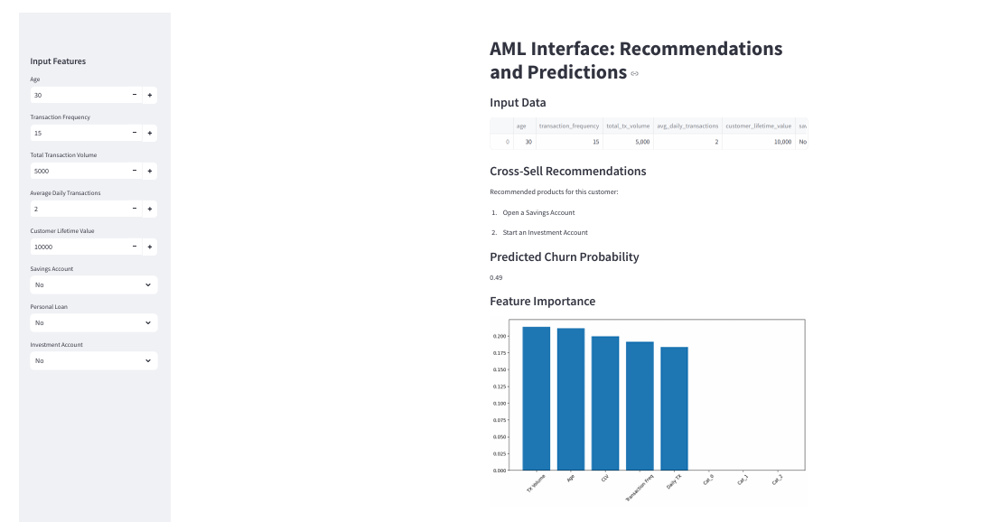

# AML Interface: Recommendations and Predictions

## Overview
This Streamlit-based web application provides customer recommendations and predictive insights for Anti-Money Laundering (AML) scenarios. It uses machine learning models to suggest financial products based on customer behavior and predicts churn probability.

## Features
- **Cross-Sell Recommendations**: Suggests financial products based on user input, such as savings accounts, personal loans, and investment accounts.
- **Predictive Analytics**: Utilizes a trained Random Forest model to estimate customer churn probability.
- **Feature Importance Visualization**: Displays a bar chart indicating which features influence predictions the most.
- **Interactive User Input**: Users can enter various financial and behavioral attributes to receive tailored insights.
- **Scalable Machine Learning Models**: The system leverages preprocessing techniques to handle both numerical and categorical data.

## Technologies Used
- **Programming Language**: Python
- **Framework**: Streamlit
- **Machine Learning**: Scikit-learn, RandomForestRegressor
- **Data Processing**: Pandas, NumPy, StandardScaler, OneHotEncoder
- **Visualization**: Matplotlib
- **Clustering**: KModes Clustering

## Installation
### Prerequisites
Ensure you have Python 3.7 or higher installed.

### Steps to Install and Run the Application
1. Clone the repository:
   ```sh
   git clone https://github.com/yourusername/aml-recommendation-app.git
   cd aml-recommendation-app
   ```
2. Create a virtual environment (optional but recommended):
   ```sh
   python -m venv venv
   source venv/bin/activate  # On Windows use `venv\Scripts\activate`
   ```
3. Install dependencies:
   ```sh
   pip install -r requirements.txt
   ```
4. Run the application:
   ```sh
   streamlit run app.py
   ```

## Usage
1. **Input Customer Data**: Enter details such as age, transaction frequency, total transaction volume, daily transactions, customer lifetime value, and financial product subscriptions.
2. **View Recommendations**: The system will suggest financial products the customer might be interested in.
3. **Predict Churn Probability**: The machine learning model estimates the likelihood of customer churn.
4. **Analyze Feature Importance**: A graphical representation shows the significance of different features used in prediction.

## Output Example

Here is a sample output of the AML Interface:




## Contributing
Contributions are welcome! To contribute:
1. Fork the repository.
2. Create a new branch (`feature-branch-name`).
3. Commit your changes.
4. Push to the branch and open a Pull Request.

## License
This project is licensed under the MIT License.


